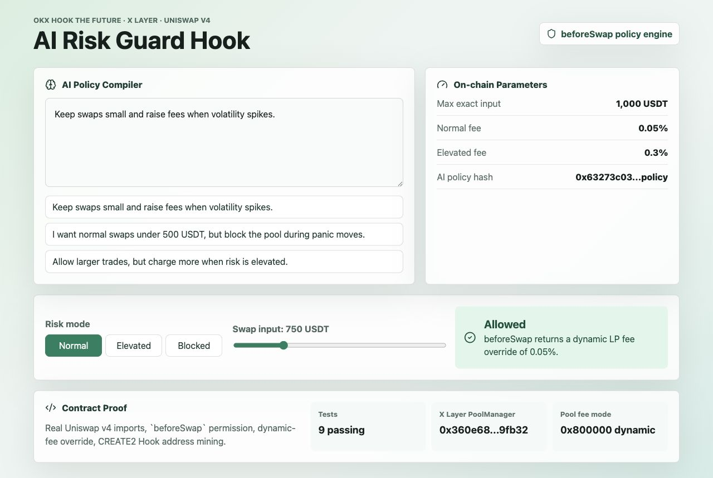

# AI Risk Guard Hook

AI Risk Guard Hook is an OKX Hook the Future hackathon project for X Layer. It turns a plain-language risk preference into a Uniswap v4 `beforeSwap` Hook policy that can reject unsafe swaps or return a dynamic LP fee override.



## Why It Exists

Most retail users cannot reason about Uniswap v4 Hooks, dynamic fees, volatility, and circuit breakers. This project makes the Hook feel like a product:

1. A user describes a risk preference in normal language.
2. The app compiles that preference into bounded policy parameters.
3. The operator writes the policy to the Hook for a v4 pool.
4. Uniswap v4 calls `beforeSwap`.
5. The Hook allows, rejects, or raises fees based on the policy.

AI proposes the policy. Solidity enforces it.

## Hook Behavior

`src/AIRiskGuardHook.sol` implements:

- per-pool policy storage keyed by Uniswap v4 `PoolId`;
- exact-input max swap limits;
- normal and elevated dynamic LP fee overrides;
- blocked-mode circuit breaker;
- owner/operator controls for hackathon demo operations.

The first version intentionally rejects exact-output swaps so the demo risk model stays clear.

## X Layer Target

The project is intended for X Layer deployment. Uniswap's official v4 deployments list includes X Layer mainnet, chain id `196`.

- X Layer mainnet chain id: `196`
- X Layer mainnet PoolManager: `0x360e68faccca8ca495c1b759fd9eee466db9fb32`
- X Layer testnet chain id: `1952`
- Testnet RPC: `https://testrpc.xlayer.tech/terigon`

For deployment details, see `docs/deployment.md`. The repo includes a `HookDeployer` CREATE2 factory and a salt miner so the Hook address has the `BEFORE_SWAP` permission bit required by Uniswap v4.

## Commands

Install dependencies:

```bash
npm install
npm --prefix app install
```

Run Solidity tests:

```bash
forge test
```

Run the full local verification suite:

```bash
npm run verify
```

Run the demo app:

```bash
npm run app:dev
```

Build the demo app:

```bash
npm run app:build
```

Mine a v4-valid Hook address after deploying `HookDeployer`:

```bash
npm run mine:hook -- "$HOOK_DEPLOYER_ADDRESS" "$XLAYER_MAINNET_POOL_MANAGER" "$OWNER_ADDRESS"
```

Generate `setPolicy` and `setRiskMode` calldata:

```bash
npm run policy:calldata -- "$HOOK_ADDRESS" "$TOKEN0" "$TOKEN1" 60 1000000000 500 3000 0 "Keep swaps small and raise fees when volatility spikes."
```

Deploy the Hook stack from a local wallet environment:

```bash
npm run deploy:xlayer
```

## Demo Script

See `docs/demo-video-script.md` for a 90-120 second recording script.

## Hackathon Checklist

- Deploy a Uniswap v4 Pool and Hook on X Layer mainnet or testnet.
- Verify the Hook contract address.
- Record a short demo video.
- Submit the repository, demo, and contract addresses through the OKX event page.
- Announce the project from a dedicated X account and tag `@XLayerOfficial`, `@Uniswap`, and `@flapdotsh`.

See `SUBMISSION.md` for the final submission pack, suggested X post, and address table.

If the deployer wallet is ready, follow `docs/operator-checklist.md`.

## Current Status

- Core Hook contract implemented.
- Foundry tests cover the policy engine.
- Demo app implemented.
- Deployment runbook, CREATE2 factory, and Hook salt miner implemented.
- Live deployment still requires a funded X Layer deployer wallet and contract verification.
